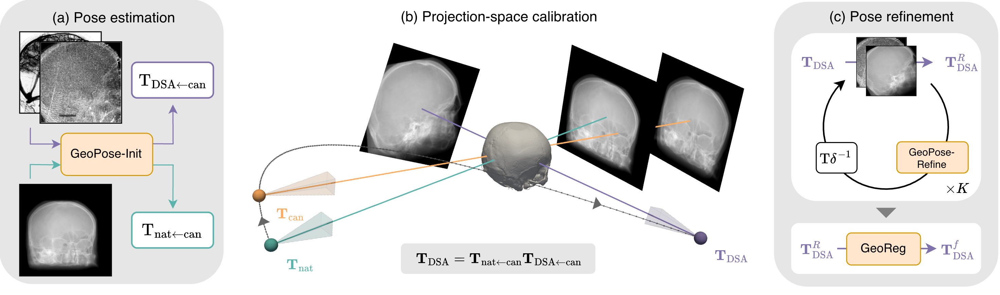

# GeoPose: Patient-agnostic CTA-to-DSA registration through projection-space calibration

<p align="center">
  
</p>
<p align="center"><sub>
Native pose → calibrated GeoPose-Init → GeoPose-Refine → 25-step GeoReg. Magenta and cyan contours show the DSA and CTA cranium silhouettes used by the test-time objective.
</sub></p>

Reproducible GeoPose training, calibration, refinement, and test-time optimization

GeoPose registers intraoperative biplanar digital subtraction angiography (DSA) to a patient's pre-procedural computed tomography angiography (CTA). It estimates the six-degree-of-freedom C-arm pose for each DSA view and expresses that pose in the native coordinate frame of an unseen CTA. The recovered geometry can project CTA anatomy onto the acquired views or support 3D vascular reconstruction from biplanar images.

The models are trained on synthetic CTA projections from a population and use fixed weights for every test patient. At inference, one render of the new CTA provides a projection-space calibration between the canonical training frame and the CTA's native frame. A population-trained network can refine the calibrated prediction, followed optionally by a short image-driven GeoReg optimization. The method requires neither patient-specific adaptation nor explicit inter-volume preregistration.

This directory contains the reference implementation described in the GeoPose preprint.

## Table of contents

- [Background](#background)
- [Install](#install)
- [Usage](#usage)
- [Method](#method)
- [Performance](#performance)
- [Data](#data)
- [Release artifacts](#release-artifacts)
- [Reproducibility](#reproducibility)
- [Pose conventions](#pose-conventions)
- [Tests](#tests)
- [Citation](#citation)
- [Maintainer](#maintainer)
- [Thanks](#thanks)
- [Contributing](#contributing)
- [License](#license)

## Background

A DSA image is a 2D projection, so it has no direct spatial correspondence with a 3D CTA. Optimization-based registration is sensitive to its starting pose and may need hundreds of rendering and optimization steps. Existing learning-based methods can reduce that search, but commonly rely on patient-specific training.

GeoPose uses a shared canonical frame to make pose labels comparable across patients. At inference, isopose calibration transfers a canonical-frame prediction to the native frame of an unregistered CTA. GeoPose-Refine then compares the target projection with a CTA render at the current pose and predicts a correction on SE(3). Neither network is fitted or updated for the new patient.

The optional final stage builds on [GeoReg](https://github.com/RoelvH97/GeoReg), which performs direct differentiable DSA-to-CTA registration. GeoPose supplies a calibrated initial pose and learned correction so that GeoReg can use a short optimization instead of starting a long search from a generic pose.

## Install

Clone the repository and create the supplied Conda environment:

```bash
git clone https://github.com/RoelvH97/GeoPose.git
cd GeoPose
conda env create -f environment.yml
conda activate geopose
```

### Dependencies

The environment pins Python 3.13, PyTorch 2.6, and the main dependencies. It also pins PyTorch3D to a specific Git commit. The supported setup for preregistration and inference is a CUDA-capable Linux environment because `fireants`, `bilateralfilter-torch`, and `HD-BET` do not provide wheels for every platform. Training smoke tests can run on a CPU.

Installation exposes three commands:

- `geopose-preregister` stages public CTA data and builds the canonical cohort.
- `geopose-train` trains GeoPose-Init or GeoPose-Refine.
- `geopose-test` runs calibration, learned refinement, and GeoReg.

The root scripts `preregister.py`, `train.py`, and `test.py` provide the same commands from a source checkout.

## Usage

### CLI

#### Prepare and align the public CTA cohort

```bash
geopose-preregister all \
  --isles-root   /path/to/isles24 \
  --carotid-root /path/to/geopose_carotids \
  --source-root  /path/to/staged \
  --output-root  /path/to/alignedv2
```

#### Train GeoPose-Init and GeoPose-Refine

```bash
geopose-train init \
  --data-root /path/to/alignedv2 \
  --output-dir runs/init \
  --seed 0

geopose-train refine \
  --data-root /path/to/alignedv2 \
  --output-dir runs/refine \
  --init-checkpoint runs/init/checkpoints/<best>.ckpt \
  --seed 0
```

Use `--smoke --accelerator cpu` to run one epoch with two sampled training batches. New checkpoints use `epoch=NNN.ckpt` filenames, and model selection monitors `val/loss`.

#### Run the packaged example

After downloading the public CTA, companion CTA cranium mask, and frozen checkpoints, run:

```bash
geopose-test \
  --data-root         /path/to/example \
  --patient           sub-stroke0011 \
  --init-checkpoint   geopose_init.ckpt \
  --refine-checkpoint geopose_refine.ckpt \
  --output-dir        runs/example
```

For `sub-stroke0011/pre`, the CLI uses the packaged projection bundle if `<data-root>/ProjectionTr/sub-stroke0011_pre.npz` is absent. An explicit `--projection-file` takes precedence.

The command writes target and render PNGs alongside `result.json`. The JSON file records checkpoint and projection hashes, calibration and optimization traces, the determinism policy, and final poses as Euler-ZYX radians, millimetre translations, and 4×4 matrices.

The default setting, `--determinism warn`, requests deterministic CUDA execution where the platform supports it. Use `error` to reject operations that PyTorch marks as nondeterministic or `off` for benchmarking. Third-party CUDA extensions may still produce slightly different results across hardware. Use one environment and pose tolerances chosen in advance for scientific comparisons.

## Method

<p align="center">
  
</p>
<p align="center"><sub>
GeoPose predicts pose in a canonical frame, transfers it to the native CTA frame, and applies learned refinement before an optional GeoReg optimization.
</sub></p>

### GeoPose-Init

`ResNetPose` predicts Euler-ZYX rotation and translation residuals relative to a view-specific isopose anchor. Training uses only synthetic digitally reconstructed radiographs with known poses. A shared ResNet-34 handles the signed view roles `LAT−`, `PA`, and `LAT+`, with rotation anchors at ±π/2 for the lateral views. The signed view role distinguishes the two lateral acquisition directions while all views share one backbone.

### Isopose calibration

A new CTA may use a different voxel or anatomical frame from the canonical training data. GeoPose renders the native CTA at a known isopose `P_iso` and passes the result through GeoPose-Init to obtain `P_cal`. Given an angiography prediction `P_pred`, it computes the native-frame pose as:

```text
P_native = P_iso · inverse(P_cal) · P_pred.
```

GeoPose computes this calibration once per CTA and shares it across the PA and LAT predictions. It requires no angiography annotation and does not update the network weights.

### GeoPose-Refine

The siamese refiner receives a target projection and a CTA render at the current pose. It predicts an axis-angle and translation correction, right-composes that correction on SE(3), and accepts an inference-time update only when multiscale normalized cross-correlation improves.

### Short GeoReg refinement

The optional final stage runs 25 NAdam steps with a OneCycle schedule over the pose parameters. Its fixed objective combines multiscale normalized cross-correlation with Dice overlap between DSA and rendered CTA cranium masks. It does not require carotid or intracranial vessel annotations for a new DSA study. GeoReg retains the pose with the best normalized cross-correlation for each view independently.

DiffDRR supplies the CTA renders used by the learned correction and the short optimization. Despite its historical name, `MAP_maskTr` contains cranium masks, not carotid masks.

## Performance

Without iterative optimization, greedy GeoPose refinement registers one biplanar pair in about 0.15 seconds on an NVIDIA H100. The measurements below were taken after warm-up and cover calibration and prediction, both view predictions, pose composition, and all configured refinement renders, network evaluations, and acceptance checks.

| Online output for one biplanar pair | Runtime on H100, mean ± SD |
| --- | ---: |
| Calibrated GeoPose-Init | 21.8 ± 2.3 ms |
| GeoPose-Init + Refine (×1) | 52.1 ± 6.9 ms |
| GeoPose-Init + greedy Refine (×K) | 147.0 ± 39.0 ms |

The timings exclude the optional 25-step GeoReg stage. With that stage, online registration takes about two seconds per biplanar pair on the same GPU class.

On 80 DSA observations from 20 held-out patients, optimization-free GeoPose reached a carotid mean projected centerline distance of 5.8 mm and a clDice of 0.45. The best-performing baseline reached 14.5 mm and 0.28. After 25 optimization iterations, GeoPose reached 4.6 mm and 0.58; native-initialized optimization reached 14.6 mm and 0.15 under the same budget. See the preprint for the evaluation protocol, complete results, and limitations.

## Data

### Training data

Training uses public ISLES'24 CTA volumes and GeoPose native-grid carotid masks:

| Source | Location |
| --- | --- |
| ISLES'24 CTA | [Zenodo record 17652035](https://zenodo.org/records/17652035) |
| GeoPose carotid masks | Companion GeoPose archive (DOI pending) |

Carotid masks supervise the synthetic training objectives. They are not needed to register a new angiography case at test time.

The frozen cohort contains 99 patients, split by patient into sets of 69, 10, and 20. The split is stored in `src/geopose/assets/isles_split_v1.json`. The dataset loader rejects missing, unassigned, or overlapping subjects.

```text
<source-root>/
  CTATr/<subject>_0000.nii.gz
  CTA_carotisTr/<subject>.nii.gz
  brainmasks_Tr/<subject>_0000_bet.nii.gz

<aligned-root>/
  images_alignedv2/<subject>_0000.nii.gz
  carotis_alignedv2/<subject>.nii.gz
  masks_alignedv2/<subject>.nii.gz
  transforms_alignedv2/<subject>.{pt,json}
```

### New-case inference data

Inference for a new patient requires a native CTA and its cranium mask, two DSA MAP projections with cranium masks, and acquisition geometry:

```text
<data-root>/
  CTATr/<subject>_0000.nii.gz
  CTA_skullTr/<subject>.nii.gz
  DSATr/<subject>_<channel>_0000.nii.gz
  MAPTr/<subject>_<channel>_0000.nii.gz
  MAP_maskTr/<subject>_<channel>.nii.gz       # DSA cranium mask
  DSA_arteriesTr/<subject>_<channel>.json     # acquisition geometry
```

The `DSA_arteriesTr` directory name comes from the research data layout. Its JSON files contain acquisition geometry; inference does not read an artery segmentation from them.

The clinical DSA series are not public, so the full-cohort inference experiment cannot be reproduced from this release. The packaged example substitutes for the private DSA inputs at the deterministic model boundary.

## Release artifacts

The Python package includes the privacy-preserving `sub-stroke0011_pre.npz` projection bundle. Before using it, the code verifies its size and SHA-256 hash. The bundle contains deterministic 256×256 DSA MAP arrays, acquisition scalars, and cranium masks. It contains neither a DSA sequence nor full-resolution angiography.

The manuscript repository is currently in its pre-archive state:

| Artifact | Status | Integrity record |
| --- | --- | --- |
| Example projection bundle | Packaged | `src/geopose/artifacts/example_sub-stroke0011.json` |
| GeoPose-Init and GeoPose-Refine checkpoints | Hashes frozen; archive URL pending | `src/geopose/artifacts/checkpoints.json` |
| Native-grid carotid masks and CTA cranium masks | Companion archive pending | `src/geopose/artifacts/data_contract.json` |

The archival release requires values for `zenodo_doi` and `download_url` in the manifests. The code rejects files that use the official checkpoint names but do not match the frozen hashes.

## Reproducibility

- The checkpoint, split, example, and source manifests contain SHA-256 records.
- The launcher passes `--seed` to Lightning, the dataset samplers, and the deterministic validation sampler.
- The release configurations reproduce the documented training procedure from public data. They cannot reproduce the published weights bit for bit because the original GeoPose-Init run did not record a global seed.
- `source_provenance.json` identifies the research and release snapshots. One test checks release-file integrity; projection-boundary tests and optional end-to-end integration tests cover behavioral equivalence separately.

## Pose conventions

Poses are DiffDRR camera transforms. Rotations use Euler-ZYX radians, and translations use millimetres with isocentre `t = (0, 650, 0)` mm. The signed view roles are `0 = LAT−`, `1 = PA`, and `2 = LAT+`. The acquisition-angle threshold is ±45°. `registration/views.py` documents two acquisition errata in the source archive.

## Tests

Run the default suite with:

```bash
pytest
```

The suite tests geometry, split and release contracts, public-data preparation, projection validation, CLI behavior, deterministic controls, and training configuration. To run the optional integration tests, set the release artifact paths first:

```bash
export GEOPOSE_INIT_CHECKPOINT=/path/to/geopose_init.ckpt
export GEOPOSE_REFINE_CHECKPOINT=/path/to/geopose_refine.ckpt
export GEOPOSE_EXAMPLE_DATA_ROOT=/path/to/example
pytest -m integration
```

Private-route equivalence also requires `GEOPOSE_PRIVATE_DATA_ROOT`. These tests are intended for the release maintainer because they depend on data that are not public.

## Citation

If you use GeoPose, cite the software and paper as described in [`CITATION.cff`](CITATION.cff). The archival paper DOI will be added when assigned.

## Maintainer

- [Rudolf L. M. van Herten](https://github.com/RoelvH97), `rlv4001@med.cornell.edu`

## Thanks

This study was supported by ZonMw Rubicon under grant no. 04520252520006. Rudolf L. M. van Herten acknowledges Vivek Gopalakrishnan's feedback during the final revision of the manuscript.

## Contributing

Questions and bug reports belong in the [GitHub issue tracker](https://github.com/RoelvH97/GeoPose/issues). Pull requests are welcome. Before submitting one, run `pytest` and describe any data or checkpoints needed to reproduce the change.

## License

[MIT](LICENSE) © 2026 GeoPose authors
